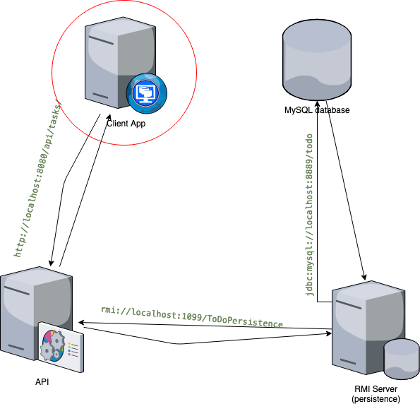

# todoListApp-client

This is a simple Todo-list application built using angular used as an example of 
client application of a 3-tier architecture. It consumes a restful Web service to 
list and add tasks.

This application depends on this [API](https://github.com/0eix/todoListApp-API) 
which exposes the services via `http://localhost:8080/api/tasks/` and this 
[RMI server](https://github.com/0eix/todoListApp-Persistence) 
that manages the data in a MySql database.




## Installation
Install `nvm` and `pyenv` if you don't have them already. Then run the following at the root of the project:
```bash
# Install the version of node used in this project
nvm install 10.9.0
```
```bash
# Set the local node version
nvm use 10.9.0
```
```bash
# Install the version of python required by node 10.9.0
pyenv install 2.7 
```
```bash
# Set the local python version
pyenv local 2.7
```
```bash
# Install the dependencies
npm install
```

## Running
```bash
# Start the application
npm start
```
